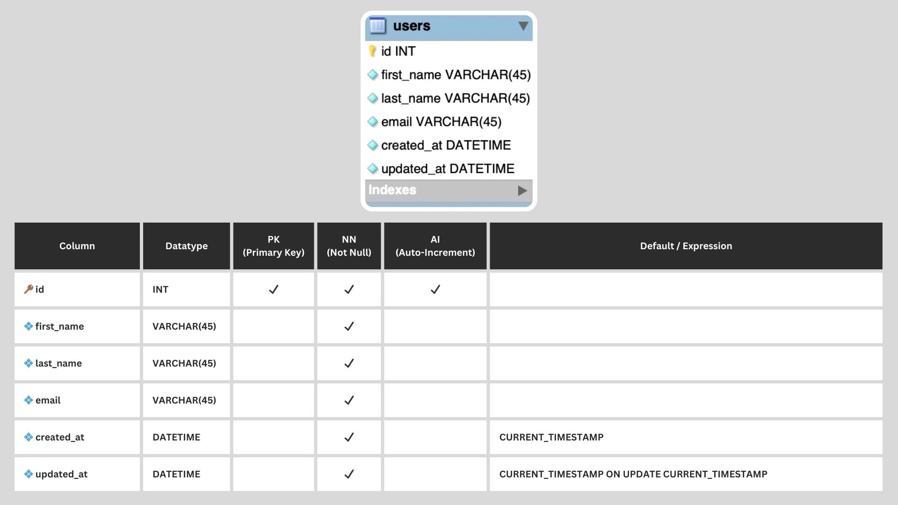

# Users

This schema consists of an ERD model representing a database for an application to track users. There are no relationships and its columns are `id`, `first_name`, `last_name`, `email`, `created_at`, and `updated_at`. This schema was created using MySQL Workbench.

---

Completed: ２０２３年１０月１２日（木）
