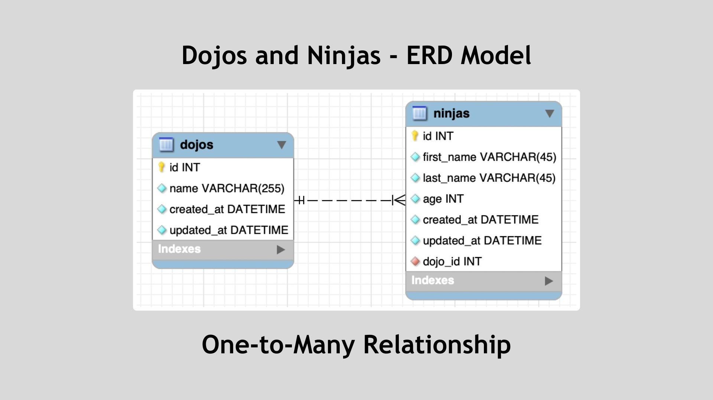
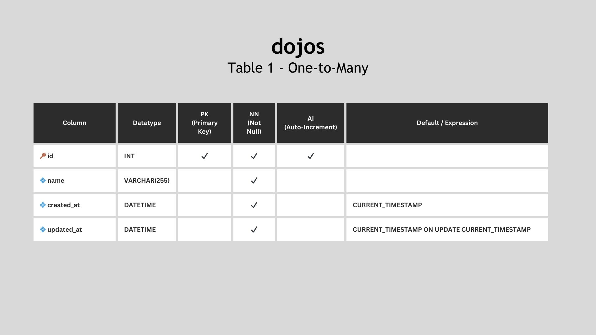
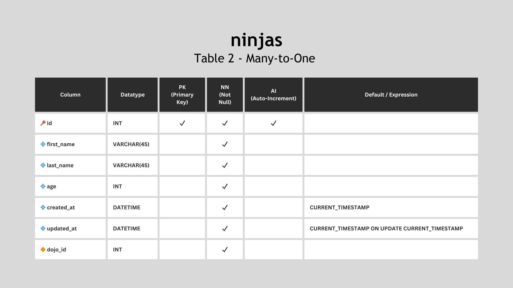

# Dojos and Ninjas ERD

The **Dojos and Ninjas Schema** is a database of students and the Dojo location at which they're enrolled. The ERD model below demonstrates the **One-to-Many** relationship to represent an application that tracks dojos, as well as the ninjas that belong to each dojo location.

The **dojos** table contains the columns of `id`, `name`, `created_at` and `updated_at` whereas the **ninjas** table consists of an `id`, `first_name`, `last_name`, `age`, `created_at`, `updated_at` and belong to a specific dojo (`dojo_id`). MySQL Workbench was used to create the ERD model.

---

Completed: ２０２３年１０月１３日（金）
