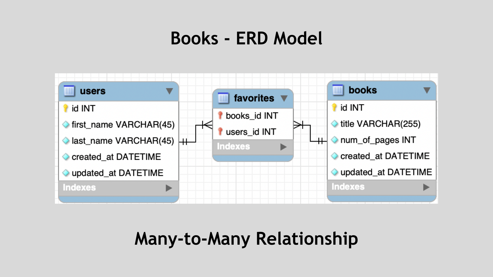
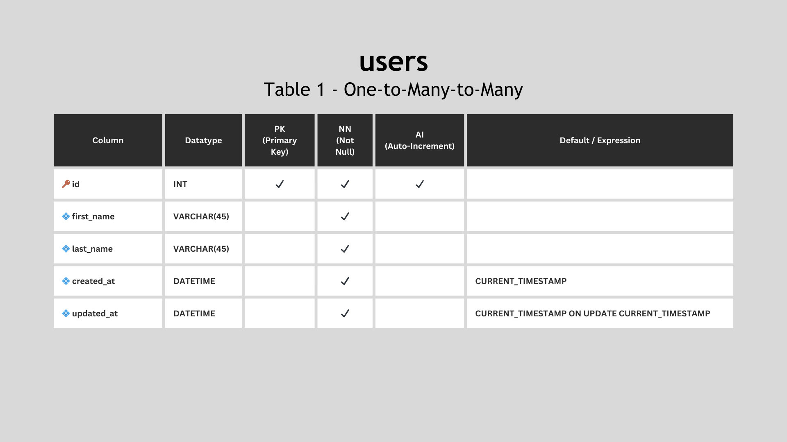
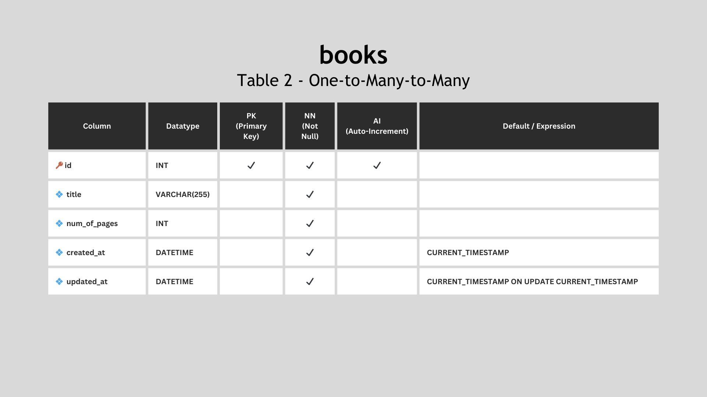
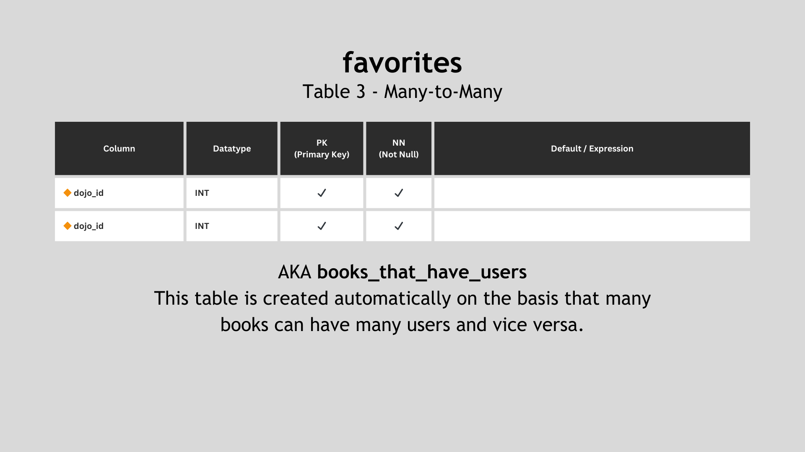
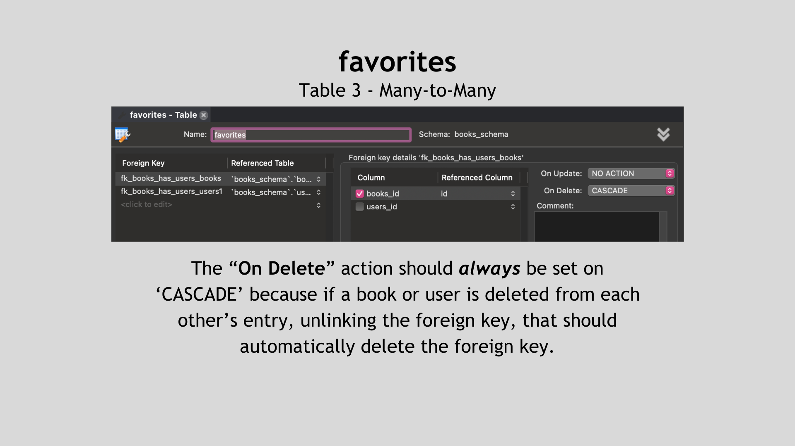

# Books ERD

The **Books Schema** contains an ERD model to represent the database for an application that tracks users, books, and the favorite books that each user recommends. The model below demonstrates the **Many-to-Many** relationship to represent an application that tracks dojos, as well as the ninjas that belong to each dojo location.

## Tables

### Users

The **users** table stores information about the users of the web application. It includes the following columns: `id`, `first_name`, `last_name`, `created_at` and `updated_at`.

### Books

The **books** table maintains a catalog of books available on the platform. It includes the following columns: `id`, `title`, `num_of_pages`, `created_at`, and `updated_at`.

### Favorites

The **favorites** table is used to represent the **_many-to-many_** relationship between users and their favorite books. This table is essential for tracking which books each user has marked as their favorites. It includes the following columns:

- **`user_id`**: A foreign key referring to the id column in the users table. This establishes a link between a user and their favorite books.

- **`book_id`**: A foreign key referring to the id column in the books table. This establishes a link between a book and users who have marked it as a favorite.

#### CASCADE On Delete

The ON DELETE action is set to CASCADE in the foreign key constraints between the favorites table and the users and books tables for the following reasons:

1. **Maintaining Data Integrity**: If a user or book is deleted from the system, it is important to ensure that associated records in the favorites table are also removed. This prevents orphaned records in the favorites table, maintaining data integrity.

2. **Reflecting User Preferences**: When a user is deleted, their favorite book associations should be removed to accurately reflect the user's preferences. Similarly, if a book is deleted, records in the favorites table should be removed to maintain consistency.

3. **Simplicity of Management**: By using CASCADE, the database system automatically handles the removal of associated records in the favorites table, reducing the need for manual intervention.

In summary, the CASCADE option ensures that when a user or book is deleted, all corresponding entries in the favorites table are also removed, ensuring data integrity and consistent representation of user preferences.

By following this database schema and its relationships, the web application can effectively manage books, users, and their favorite book selections.

---

Completed: ２０２３年１０月２５日（水）
