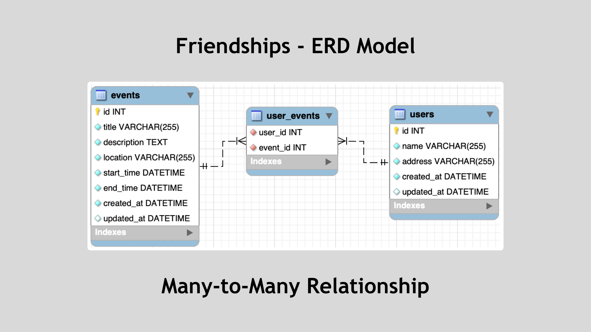
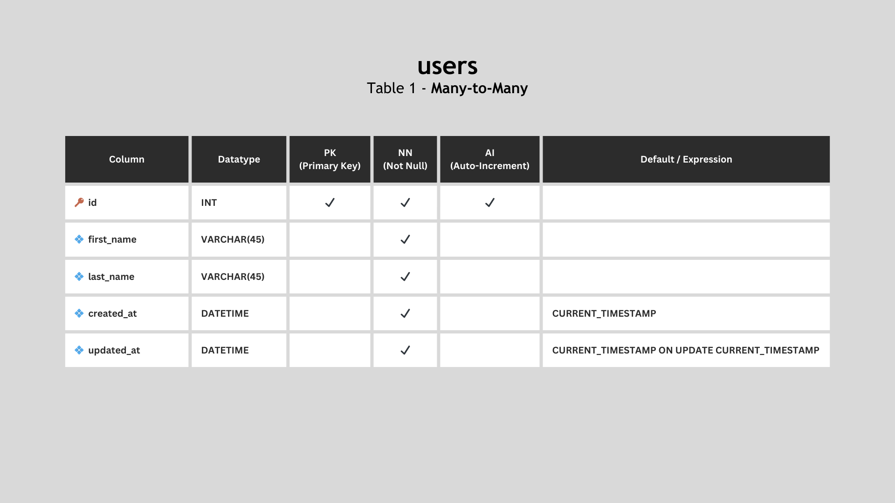
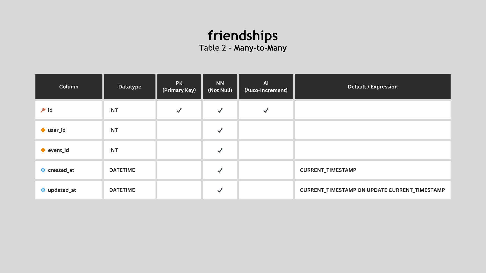
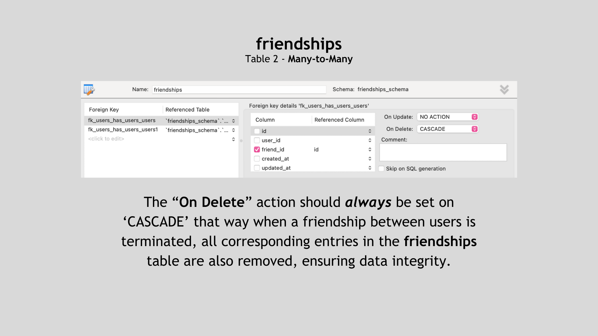

# Friendships

The **Friendships Schema** contains an ERD model to represent the database for a social media application to track users and their friends.

## Tables

### Users

The **`users`** table stores information about the users of the social media application. It includes the following columns: `id`, `name`, `address`, `created_at` and `updated_at`.

### Friendships

To establish a **many-to-many** relationship between users, we create a **self-join relationship** where a user can be friends with another user from the same table. This relationship is represented by a junction table, which is not explicitly mentioned in the Entity Definitions but is a crucial part of the database schema.

- `user_id` (Foreign key): This column establishes a relationship with the `id` column of the **`Users`** table to represent the user who initiated the friendship. 

- `friendship_id` (Foreign key): This foreign key also points to the **`Users`** table, but it represents the other user who is the recipient of the friendship. It identifies the user who is the target of the friendship initiated by the user referenced in `user_id`. This key completes the connection in the friendship relationship, making it a two-way link.

<!-- ? Together, these foreign keys create a many-to-many relationship between users in the same **`Users`** table. This self-join relationship allows users to connect with multiple other users, forming friendships. The combination of `user_id` and `friendship_id` in the junction table tracks who is friends with whom, facilitating the representation of complex friendships in the database. -->

#### CASCADE On Delete

<!-- ? In a this **many-to-many self-join relationship** used to represent friendships between users, each record in the junction table (the table that joins users as friends) connects two user records. These records have foreign keys pointing to the same table, i.e., the **`Users`** table. -->

When you set "**CASCADE on Delete**" in the relationship, it means that if you delete a user from the **`Users`** table, it will also trigger the deletion of related records in the junction table. This is essential for the following reasons:

1. **Data Integrity**: By cascading the delete operation, you ensure that when a user is removed from the system, their friendships are also removed. Without this, you could end up with dangling references in the junction table, where a user's friend still points to a non-existing user, which would violate data integrity.

2. **Prevent orphans**: Deleting a user without cascading would leave their friends in the junction table without an associated user. This could lead to confusion, potential errors, or unexpected behavior in your application.

3. **Simplified Maintenance**: Setting up cascade on delete makes maintenance of the database more straightforward. You don't need to manually find and remove related friendship records when a user is deleted; the database system handles it automatically.

4. **Consistency**: It ensures that your database remains consistent, with no lingering data pointing to users that no longer exist.

In summary, setting "CASCADE on Delete" in a many-to-many self-join relationship is crucial for maintaining data integrity, preventing orphaned records, simplifying maintenance, and ensuring the consistency of your database when dealing with complex relationships like tracking friendships on a social media platform.

---

Completed: ２０２３年１１月０８日（水）
