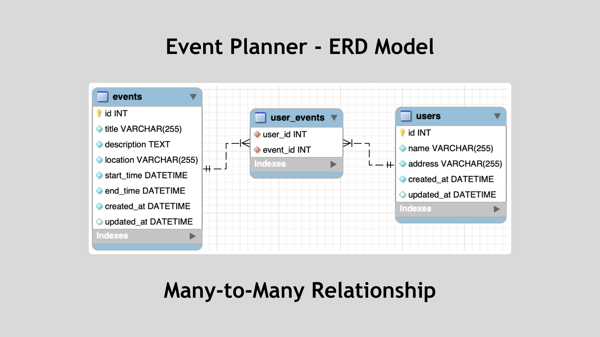
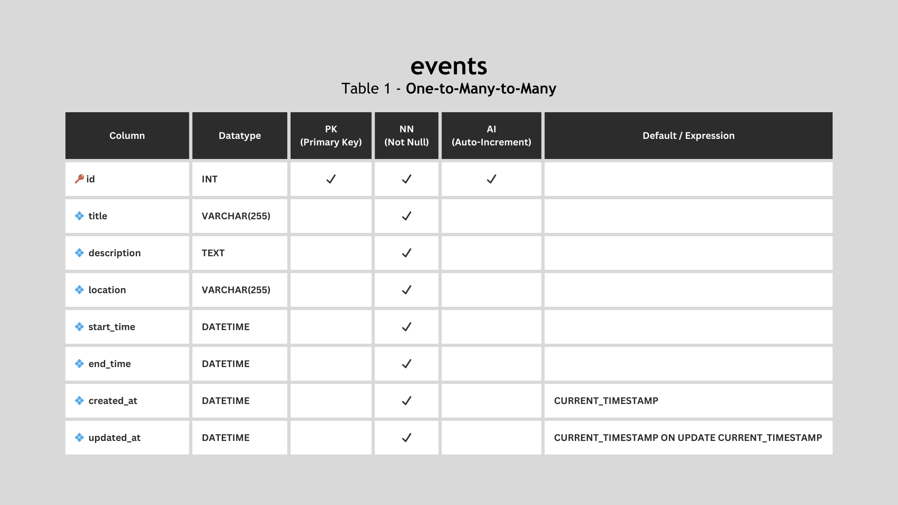
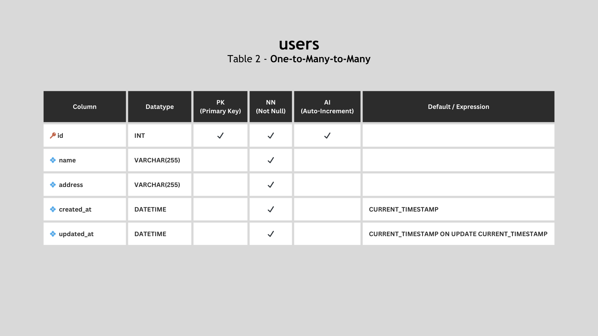
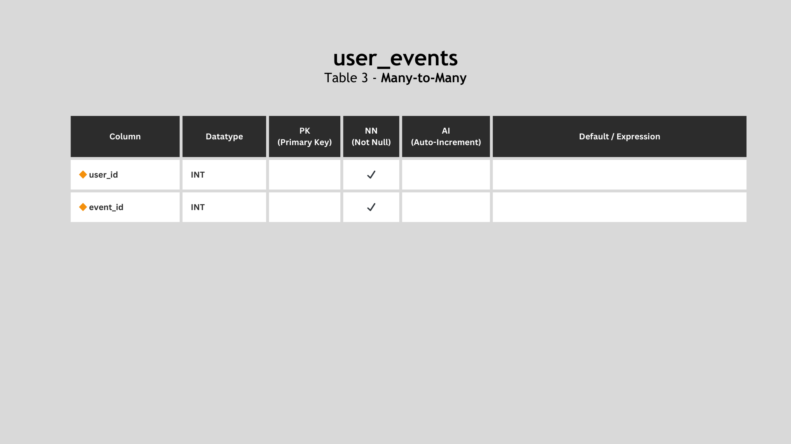
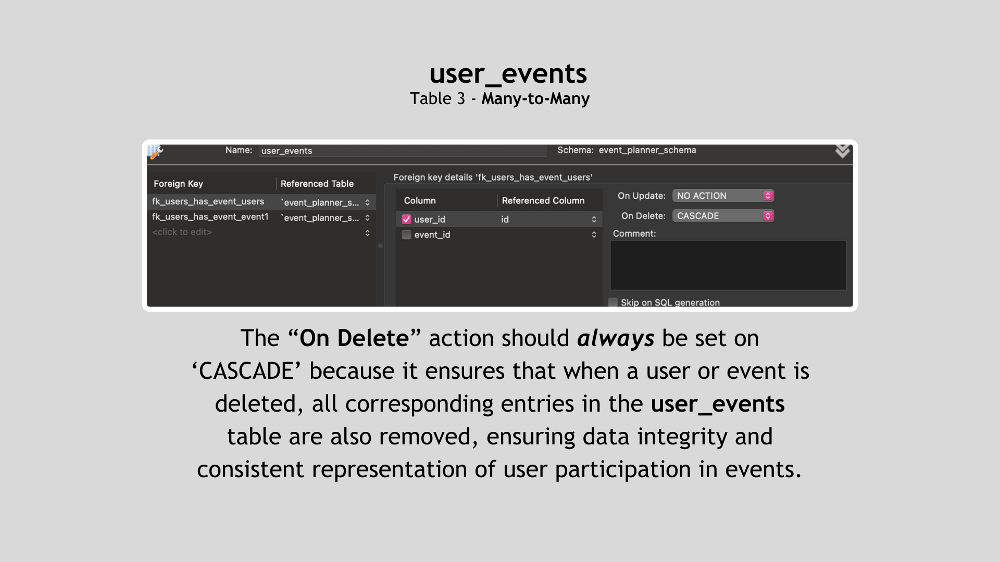

# Event Planner ERD

The **Event Planner Schema** contains an ERD model to represent the database for an application that tracks users, events, and the events created by them. The model below demonstrates the **Many-to-Many** relationship to represent an application that allows users to plan events and RSVP to others' events.

## Tables

### Events

The **events** table maintains a list of events available to sign up for on the platform. It includes the following columns: `id`, `title`, `description`, `location`, `start_time`, `end_time`, `created_at`, and `updated_at`.

### Users

The **users** table stores information about the users of the web application. It includes the following columns: `id`, `name`, `address`, `created_at` and `updated_at`.

### User Events

The **user_events** table is used to represent the **_many-to-many_** relationship between users and the events they plan. It facilitates the RSVP system for events.

- `user_id` (Foreign Key): This column establishes a relationship with the `id` column in the `users` table. It signifies the user who plans or participates in an event.

- `event_id` (Foreign Key): This column establishes a relationship with the `id` column in the `events` table. It signifies the event that a user plans or RSVPs to.

In this schema, the **user_events** table is essential for tracking which users plan which events and their participation status.

#### Cascade ON DELETE

The ON DELETE action in the foreign key constraints between the **user_events** table and the **users** and **events** tables is set to CASCADE. This is done to ensure data integrity and consistency for the following reasons:

1. **Maintaining Data Integrity**: If a user or event is deleted from the system, it is crucial to ensure that associated records in the **user_events** table are also removed. This prevents orphaned records in the **user_events** table, maintaining data integrity.

2. **Reflecting User Participation**: When a user is deleted, their planned events and RSVPs should be removed to accurately reflect the user's participation status. Similarly, if an event is deleted, records in the **user_events** table should be removed to maintain consistency.

3. **Simplicity of Management**: By using CASCADE, the database system automatically handles the removal of associated records in the **user_events** table, reducing the need for manual intervention.

In summary, the CASCADE option ensures that when a user or event is deleted, all corresponding entries in the user_events table are also removed, ensuring data integrity and consistent representation of user participation in events.

By following this database schema and its relationships, the web application can effectively manage events, users, and their event planning and RSVP activities. The use of CASCADE ON DELETE for the user_id and event_id foreign keys in the user_events table simplifies the management of event participation, making it easy to maintain an accurate and up-to-date record of which users are planning or attending which events.

This design promotes a seamless RSVP system, enhancing the user experience for event planning and participation.

---

Completed: ２０２３年１１月０２日（木）
