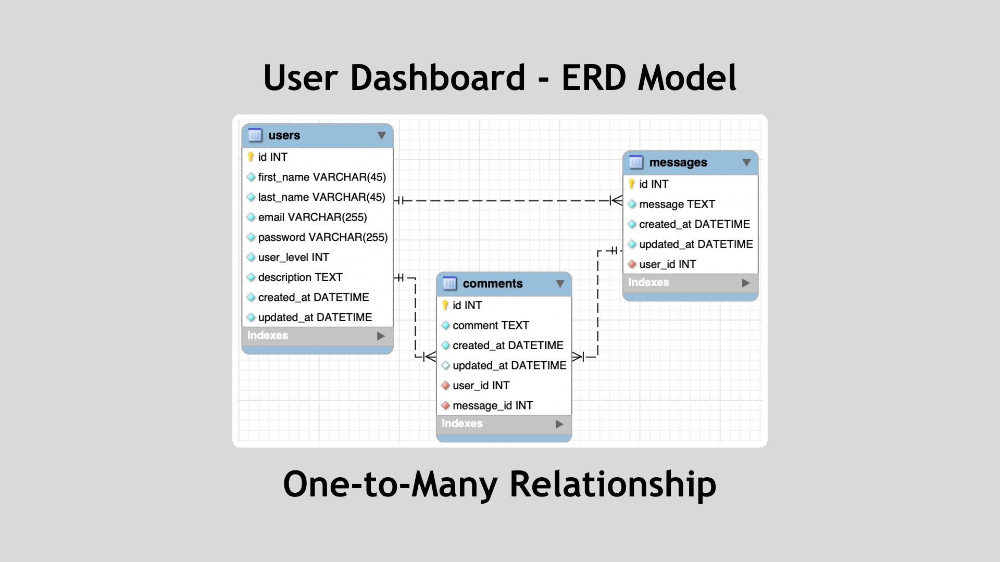
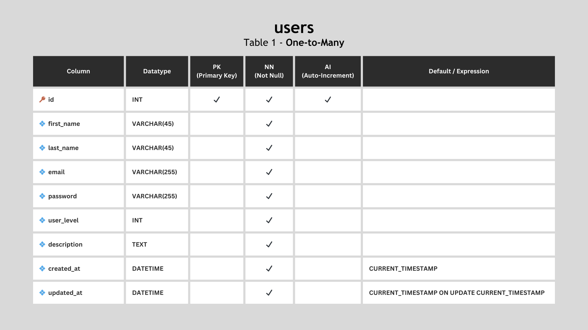
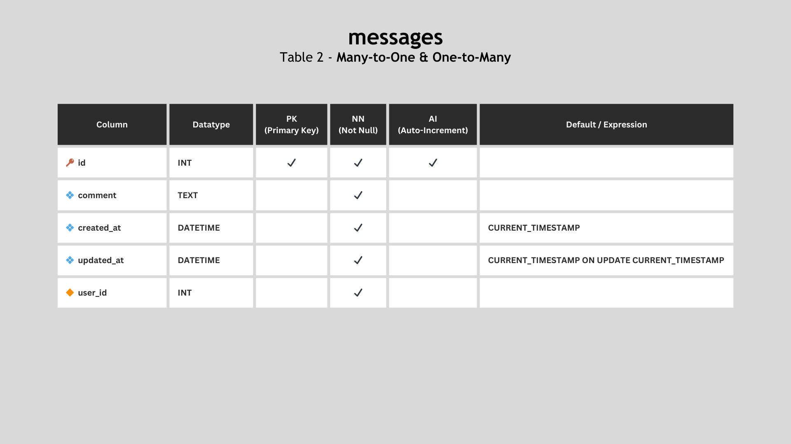
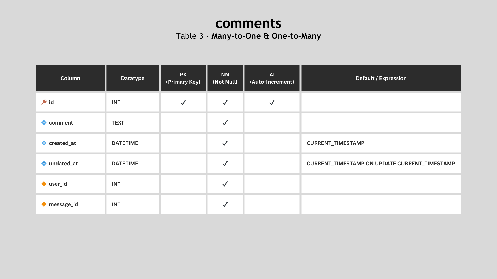

# User Dashboard

The **User Dashboard Schema** contains an ERD model representing the database structure for a social media application. The diagram illustrates key **One-to-Many** relationships.

## Tables

### Users

The **users** table contains user profile information, featuring columns such as `id`, `first_name`, `last_name`, `email`, `password`, `user_level`, `description`, `created_at`, and `updated_at`:

### Messages

The **messages** table holds message data with the following columns: `id`, `content`, `created_at`, `updated_at`, and a foreign key, `user_id`:

### Comments

The **comments** table manages comments with the following columns: `id`, `content`, `created_at`, `updated_at`, and foreign keys `user_id` and `message_id`:

#### Cascade ON DELETE

In the context of the **comments** and **messages** tables, the "Cascade ON DELETE" feature is crucial for maintaining data integrity. When a user account is deleted, the cascade effect ensures that associated comments and messages linked to that user are also deleted. This prevents orphaned records and maintains a clean and consistent database structure.

---

Completed: ２０２３年１１月０９日（木）
