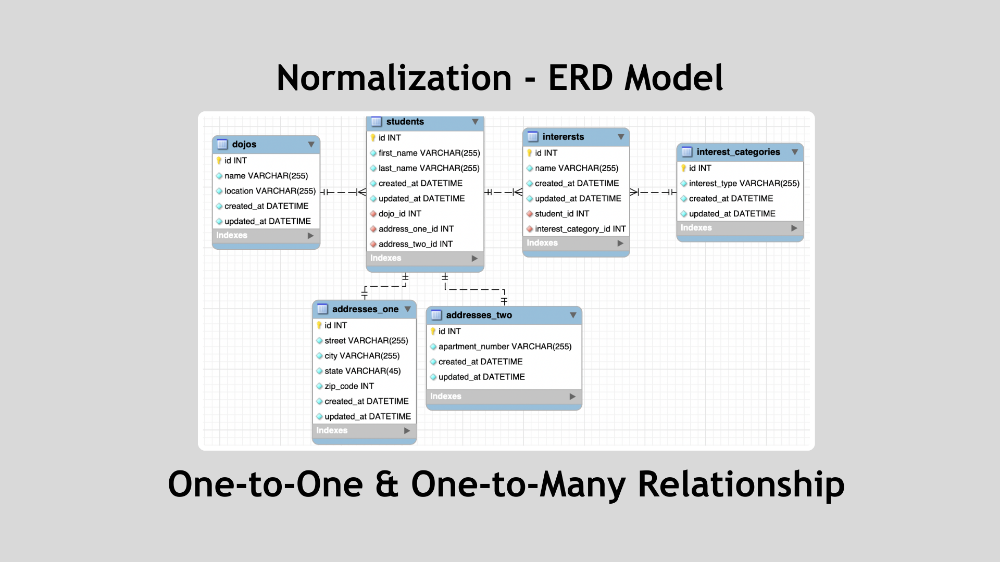
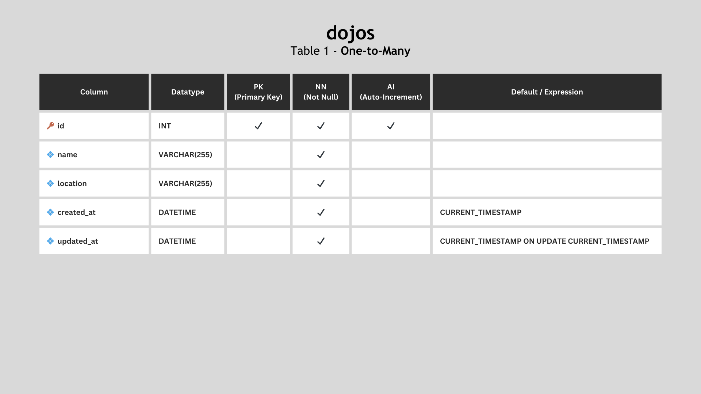
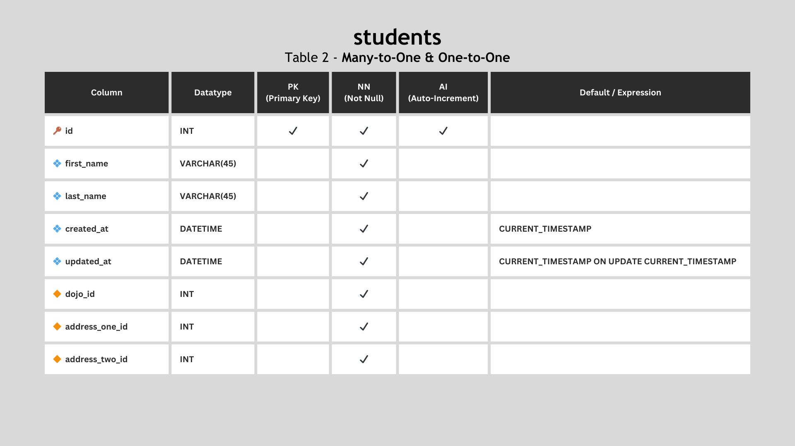
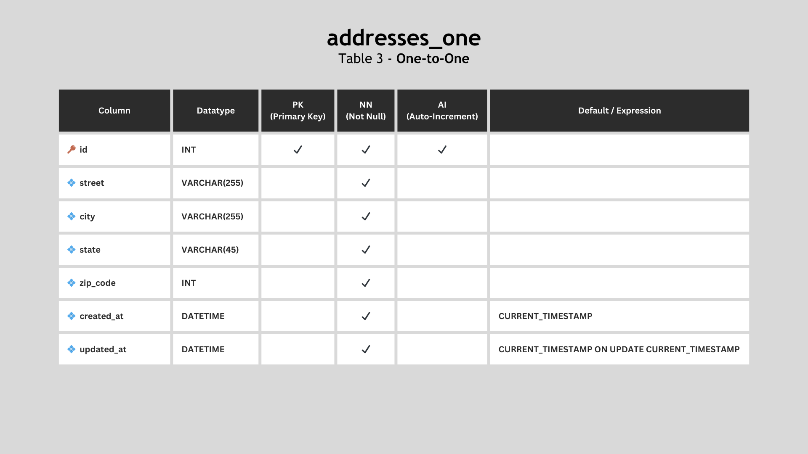
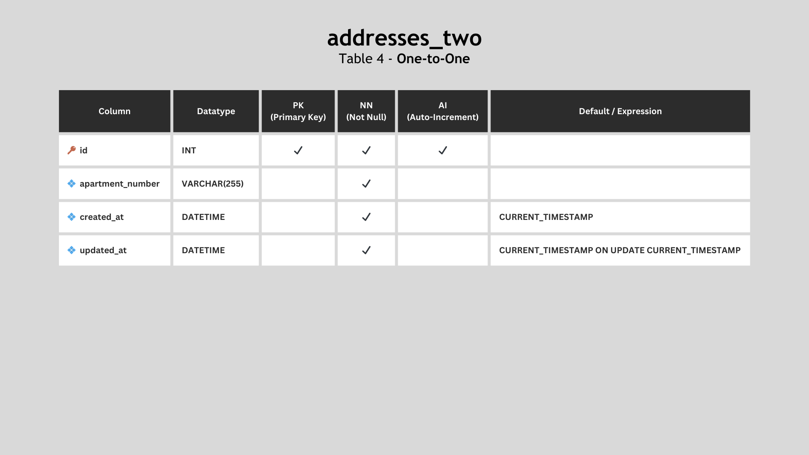
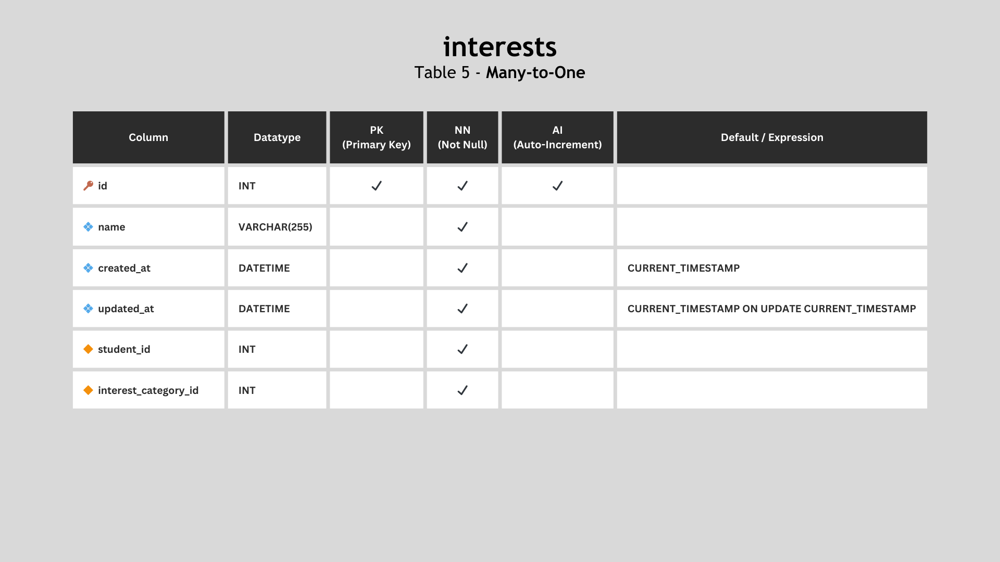
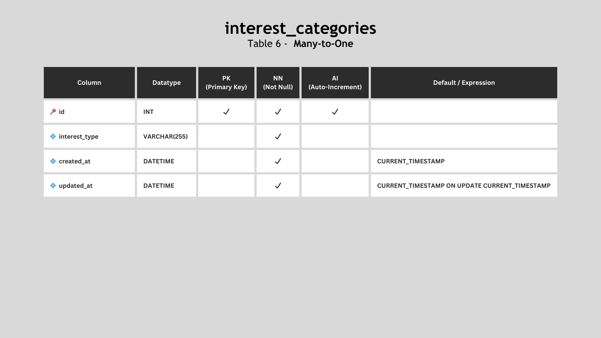

# Normalization ERD

The **Normalization schema** represents a database structure designed to manage student information and interests. It includes tables for dojos (locations where students can be enrolled), students' personal details, two types of addresses, and a categorization of student interests. The schema follows normalization principles to organize data efficiently, with clear relationships between entities to avoid data redundancy and maintain data integrity.

  

## Tables

### Dojos

The **dojos** table contains the list of dojos where students can be enrolled. This table features columns such as `id`, `name`, `location`, `created_at`, and `updated_at`.

  

### Students

The **students** table contains student information, featuring columns such as `id`, `first_name`, `last_name`, `created_at`, `updated_at`, and the foreign keys `dojo_id`, `address_one_id`, and `address_two_id`.

  

### Addresses One

The **addresses_one** table contains information about the first address line, with columns `id`, `street`, `city`, `state`, `zip_code`, `created_at`, and `updated_at`.

  

### Addresses Two

The **addresses_two** table contains information about the second address line, with columns `id`, `apartment_number`, `created_at`, and `updated_at`.

  

### Interests

The **interests** table contains information about student interests, featuring columns such as `id`, `name`, `created_at`, `updated_at`, and the foreign keys `student_id` and `interest_category_id`.

  

### Interest Categories

The **interest_categories** table serves as a category for student interests, featuring columns `id`, `name`, `created_at`, and `updated_at`.

  

## Cascade ON DELETE

Setting `CASCADE ON DELETE` in a database schema is important for maintaining referential integrity, especially when dealing with foreign key relationships. In the context of the provided schema, here's why setting `CASCADE ON DELETE` might be beneficial:

1. **Address Deletion:**
   - If a student's address information is linked to the `addresses_one` or `addresses_two` tables through foreign keys in the `students` table, setting `CASCADE ON DELETE` ensures that when an address is deleted, associated student records are also automatically deleted. This prevents orphaned student records with references to non-existent addresses.

2. **Dojo Deletion:**
   - Similarly, if a dojo is deleted from the `dojos` table, having `CASCADE ON DELETE` on the foreign key in the `students` table ensures that all student records associated with that dojo are also deleted. This maintains consistency and avoids having students associated with non-existent dojos.

3. **Interest Category Deletion:**
   - If an interest category is deleted from the `interest_categories` table, having `CASCADE ON DELETE` on the foreign key in the `interests` table ensures that all interest records associated with that category are also deleted. This helps in keeping the database free from inconsistencies.

By using `CASCADE ON DELETE`, you automate the deletion of dependent records, simplifying data management and ensuring that your database remains in a consistent state. However, it's crucial to carefully consider the implications of cascading deletes to avoid unintentional data loss. Always ensure that cascading deletes align with your application's business logic and data integrity requirements.

---

Completed: ２０２３年１１月１０日（金）
