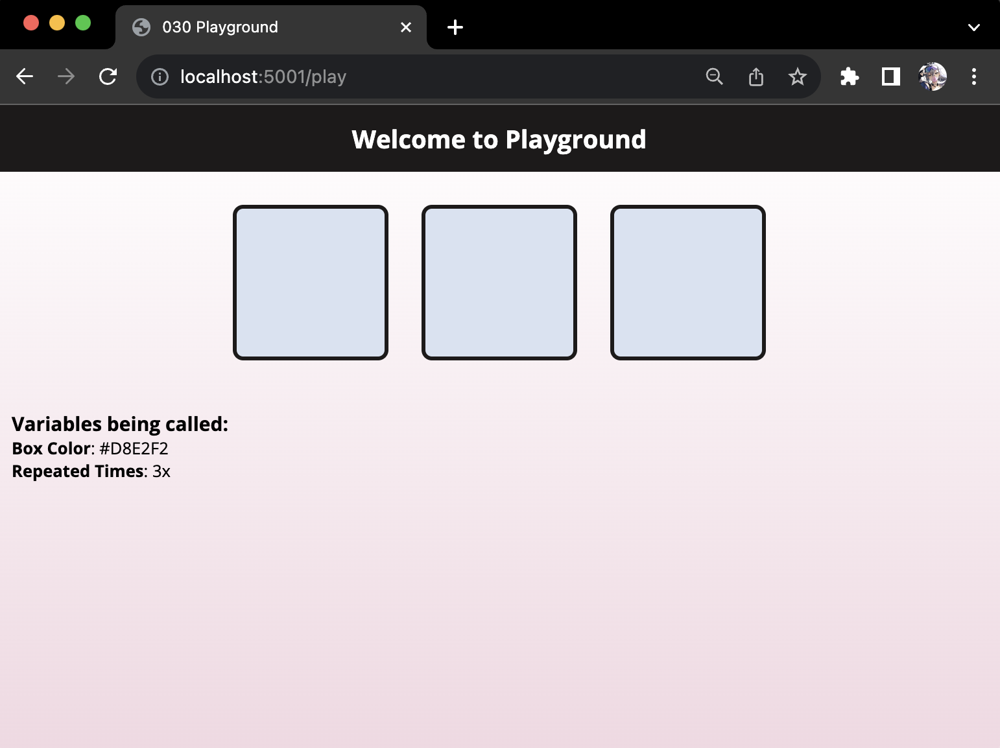

# Playground

The **Playground Flask App** is a simple web application that demonstrates how to use Flask for creating dynamic web pages with different routes and templates. It allows you to generate a page with colorful boxes based on the specified parameters.

### Table of Contents

1. [Routes and Their Functions](#routes-and-their-functions)
2. [Understanding Jinja Syntax](#understanding-jinja-syntax)
3. [Screen Height Adjustment](#screen-height-adjustment)

## Routes and Their Functions

The Flask application (`server.py`) defines several routes, each serving a specific purpose. Here's a breakdown of the routes and their functions:

#### 1. Root Route - Redirect to "`/play`"

- **URL**: `/`
- **Function**: `hello()`
- **Description**: When you access the root URL, it redirects you to the `/play` route.

#### 2. "`/play`" Route - Display Blue Boxes

<div align="center">

</div>

- **URL**: `/play`
- **Function**: `lvl_one()`
- **Description**: This route renders a template with three blue boxes. The `box_color` is set to "#D8E2F2," and it repeats three times.

#### 3. "`/play/<int:x>`" Route - Display Custom Number of Blue Boxes

<div align="center">

</div>

- **URL**: `/play/<int:x>`
- **Function**: `lvl_two(x)`
- **Description**: This route allows you to specify the number of blue boxes to display. It renders a template with a custom number of blue boxes (specified by `x`).

#### 4. "`/play/<int:x>/<color>`" Route - Display Custom Number of Colored Boxes

<div align="center">

</div>

- **URL**: `/play/<int:x>/<color>`
- **Function**: `lvl_three(x, color)`
- **Description**: You can customize the number of boxes and their color. This route renders a template with a specified number of boxes (`x`) with the background color set to the provided value (`color`).

#### 5. Handling Undefined Routes

<div align="center">

</div>

If you enter an invalid route, the application will display an error message and provide a list of valid route formats. For example, if you enter `http://localhost:5001/pla`, you will see the message:

```markdown
### Please Enter a valid route.
#### Example URL Format:
1. /play
2. /play/{number_of_boxes}
3. /play/{number_of_boxes}/{color}

Please see the README.md to see how the URL links are formatted for an accurate example.
```

## Understanding Jinja Syntax

In the provided template (`index.html`), Jinja2 templating syntax is used to insert dynamic content generated by Flask. Here's how Jinja syntax is used:

- `{{ box_color }}` and `{{ times }}`: These placeholders are replaced with actual values passed from the Flask routes. For example, `{{ box_color }}` displays the box color, and `{{ times }}` displays the number of times a box should be repeated.

#### Screen Height Adjustment

To ensure that the webpage's background extends to the full screen height but doesn't awkwardly cut off when scrolling, a script in the HTML file is used. The script checks if the content's height exceeds the viewport height (100vh). If it does, it sets the `html` element's height to `fit-content`. If not, it sets the height to `100vh`.

```html
<script>
    if (document.body.scrollHeight > window.innerHeight) {
        document.documentElement.style.setProperty('--html-height', 'fit-content');
    } else {
        document.documentElement.style.setProperty('--html-height', '100vh');
    }
</script>
```

This allows the content to be displayed within the viewport height when it fits and to expand further when the content overflows.

---
<p align="right">Completed: ２０２３年１０月１１日（水）</p>