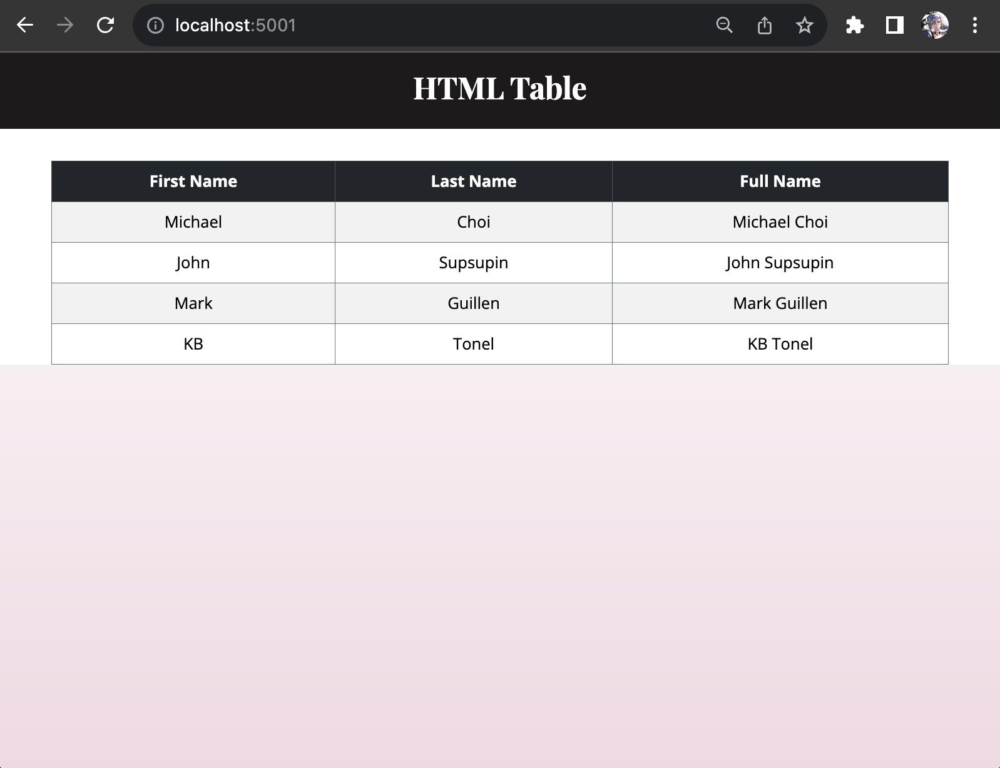

# HTML Table

This Flask application demonstrates how to pass data from the server to an HTML template using Jinja2 rendering. In this example, we will create an HTML table to display a list of users' first names, last names, and their full names.


## Index Route

<div align="center">

</div>

- **Route**: `/`
- **Description**: Renders a table displaying the first name, last name, and full name of the users from a list in the backend.
- **Example URL**: `http://localhost:5001/`


In the Flask server, we create a route that renders the HTML template and passes the user data to it.

```python
@app.route('/')
def test():
    users_list = [
        {'first_name': 'Michael', 'last_name': 'Choi'},
        {'first_name': 'John', 'last_name': 'Supsupin'},
        {'first_name': 'Mark', 'last_name': 'Guillen'},
        {'first_name': 'KB', 'last_name': 'Tonel'},
    ]
    return render_template('index.html', users=users_list)
```

In the HTML template, the Jinja For Statement `` is used to iterate over the users list received from the server. Within the loop, we use `{{ user.first_name }}` and `{{ user.last_name }}` to display the user's first name, last name, and `{{ user.first_name }} {{ user.last_name }}` to display the full name.
```html
<tbody>
    
    <tr>
        <td>{{ user.first_name }}</td>
        <td>{{ user.last_name }}</td>
        <td>{{ user.first_name }} {{ user.last_name }}</td>
    </tr>
    
</tbody>
```

### Running the Application

Activate the Virtual Environment pipenv shell And start the server: python3 server.py The app will run in debug mode on http://localhost:5001/. You can access the various routes to see how the content is dynamically rendered using Jinja2 templates.

**NOTES:**
- To see how this Flask application was initially set up, [check this project](https://github.com/coderbri/Python-Jan2023/blob/main/Wk4-Flask/Lecture-Code/D9-Templates_Jinja_and_Static_Files/README.md#initial-setup).
- For more information on screen-height adjustment, [check this project](https://github.com/coderbri/Python-Jan2023/blob/main/Wk4-Flask/030-Playground/README.md#screen-height-adjustment).


---
<p align="right">Completed: ２０２３年１０月２４日（火）</p>