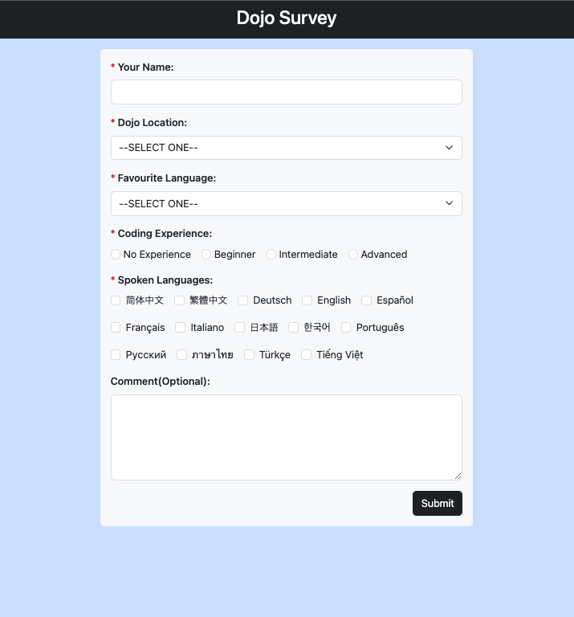
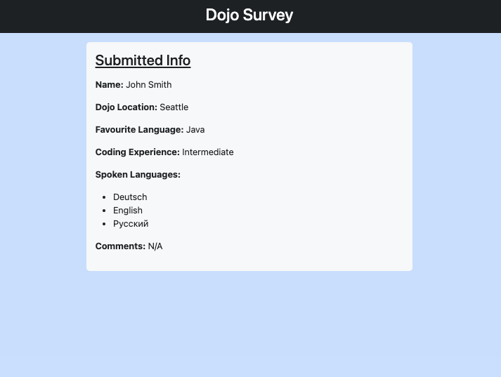

# Dojo Survey

The **Dojo Survey** is a simple Flask web application that allows users to submit a survey form with their name, preferred Dojo location, favorite programming language, and optional comments. This README provides an overview of the project's structure and functionality.

### Table of Contents
1. [Project Structure](#project-structure)
2. [Routes and Methods](#routes-and-methods)
    - [Root Route](#1-root-route)
    - [Submit Form](#2-submit-form)
    - [Results Page](#3-results-page)
2. [Session Usage](#session-usage)
2. [Form Setup in Flask](#form-setup-in-flask)

## Project Structure

- `server.py`: This is the main Python script containing the Flask application. It defines the routes and the logic for handling form submissions and displaying survey results.

- `templates/`: This directory contains HTML templates for rendering the web pages.

    - `index.html`: The form page where users can input their survey information.

    - `results.html`: The page that displays the survey results.

- `static/`: You can store static files like CSS, JavaScript, or images in this directory, but they are not used in this example.

## Routes and Methods

#### 1. Root Route

<div align="center">

</div>

- **Route**: `/`
- **Method**: GET
- **Description**: This route renders the homepage, which is the survey form. Users can input their information, including name, Dojo location, favorite programming language, and optional comments.

#### 2. Submit Form

- **Route**: `/submit`
- **Method**: POST
- **Description**: This route handles form submissions. It validates the form data, stores it in the session, and redirects to the `/results` route if the data is valid. If any required fields are empty, it displays an error message and returns to the form page.

#### 3. Results Page

<div align="center">

</div>

- **Route**: `/results`
- **Method**: GET
- **Description**: This route displays the survey results. It retrieves the form data from the session and renders it on the `results.html` template.


## Session Usage

In this project, the **`session`** object provided by Flask is used to store and pass data between routes and templates. The **`session`** allows us to maintain user-specific data across multiple requests. In particular, it's used to store the form data and pass it to the **`results.html`** template.

The **`submit_form`** route stores the form data in the session like this:

```python
form_data = {
    'name': request.form.get('name'),
    'location': request.form.get('location'),
    'fav_language': request.form.get('fav_language'),
    'experience': request.form.get('experience'),
    'spoken_languages': request.form.getlist('spoken_languages'), # New addition
    'comments': request.form.get('comments')
}
session['form_data'] = form_data
```

The **`results`** route retrieves the form data from the session and passes it to the results.html template:
```python
form_data = session.get('form_data', {})
return render_template('results.html', user_result=form_data)
```


### Form Setup in Flask

In the **Dojo Survey** Flask application, forms are set up using HTML. The naming of labels and input fields plays a crucial role in the server-side processing in `server.py`. Here's an overview of how it works:

1. **HTML Form Structure**: In the HTML template (e.g., `index.html`), the structure of the form is defined using the `<form>` element. Inside the form, there are input fields for collecting user data. Each input field is associated with a label and has a unique `name` attribute. For example:

    ```html
    <div class="mb-3">
        <label for="name" class="form-label">Your Name:</label>
        <input type="text" name="name" class="form-control">
    </div>
    ```

    In this code snippet, the `<label>` is associated with the `<input>` field using the `for` attribute, and the `name` attribute is specified for the `<input>` field.

2. **HTTP POST Request**: When a user submits the form by clicking the "Submit" button, the browser sends an HTTP POST request to the server, including the data entered into the form fields. The `name` attribute of each input field serves as the key for the submitted data.

3. **Data Retrieval in `server.py`**: In the Flask application's `server.py`, the form submission is handled in the `/submit` route. The `request.form` object is used to access the data submitted in the POST request. Data retrieval is accomplished by specifying the `name` attribute of each input field as the key. For example:

    ```python
    name = request.form.get('name')
    ```

    Here, `name` is assigned the value that the user entered into the "name" field, as specified by the `name` attribute.

4. **Validation and Processing**: With the form data available in `server.py`, validations can be performed, data can be processed, and the data can be stored as needed. For instance, a dictionary can be created to store the data, and it can be stored in the session for future use.

5. **Feedback and Redirection**: Based on the form data and any validation results, feedback can be provided to the user. This can include displaying an error message if required fields are empty or redirecting the user to another page, such as `/results`.

By naming the labels and input fields and associating them with unique `name` attributes, a direct link is established between the HTML form and the server-side code. This naming convention allows for effective retrieval, processing, and validation of the form data in `server.py`, making it a fundamental part of the web application's functionality.

**NOTES:**
- To see how this Flask application was initially set up, [check this project](https://github.com/coderbri/Python-Jan2023/blob/main/Wk4-Flask/Lecture-Code/D9-Templates_Jinja_and_Static_Files/README.md#initial-setup).

---
<p align="right">Completed: ２０２３年１１月０７日（火）</p>