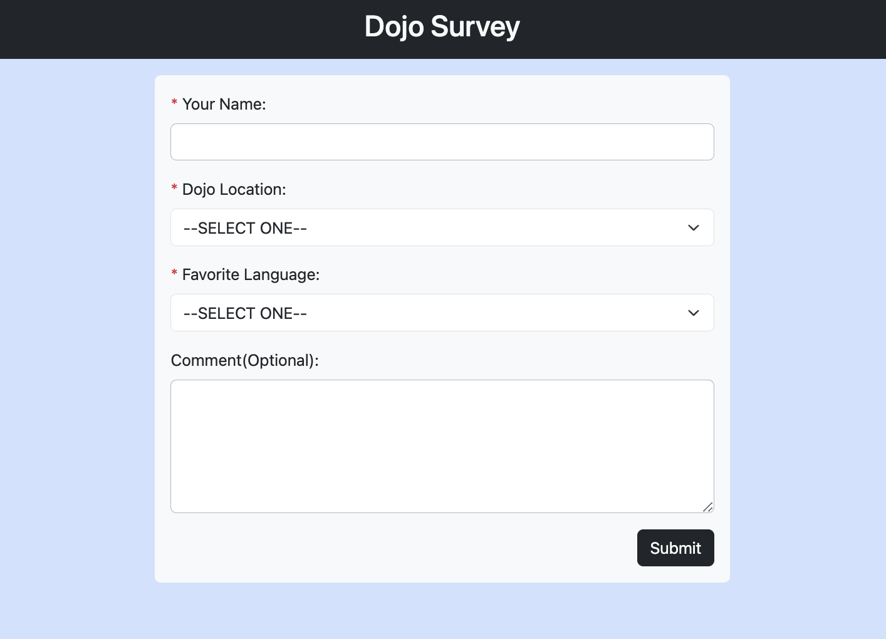
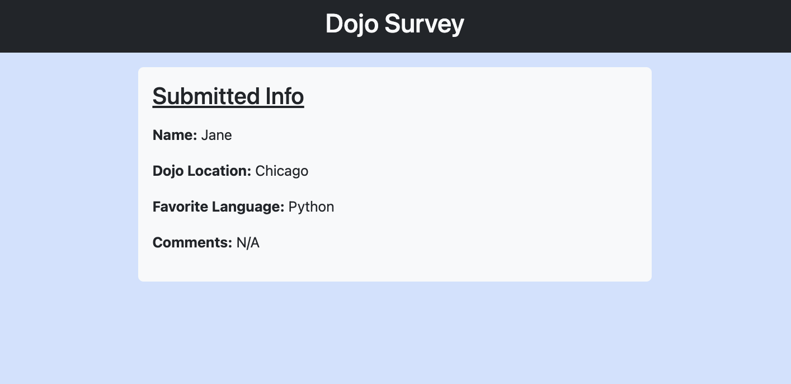

# Dojo Survey

The "Dojo Survey" is a simple Flask web application that allows users to submit a survey form with their name, preferred Dojo location, favorite programming language, and optional comments. This README provides an overview of the project's structure and functionality.

### Table of Contents
1. [Project Structure](#project-structure)
2. [Routes and Methods](#routes-and-methods)
    - [Root Route](#1-root-route)
    - [Submit Form](#2-submit-form)
    - [Results Page](#3-results-page)
2. [Session Usage](#session-usage)
2. [Form Setup in Flask](#form-setup-in-flask)

## Project Structure

- `server.py`: This is the main Python script containing the Flask application. It defines the routes and the logic for handling form submissions and displaying survey results.

- `templates/`: This directory contains HTML templates for rendering the web pages.

    - `index.html`: The form page where users can input their survey information.

    - `results.html`: The page that displays the survey results.

- `static/`: You can store static files like CSS, JavaScript, or images in this directory, but they are not used in this example.

## Routes and Methods

#### 1. Root Route

<div align="center">

</div>

- **Route**: `/`
- **Method**: GET
- **Description**: This route renders the homepage, which is the survey form. Users can input their information, including name, Dojo location, favorite programming language, and optional comments.

#### 2. Submit Form

- **Route**: `/submit`
- **Method**: POST
- **Description**: This route handles form submissions. It validates the form data, stores it in the session, and redirects to the `/results` route if the data is valid. If any required fields are empty, it displays an error message and returns to the form page.

#### 3. Results Page

<div align="center">

</div>

- **Route**: `/results`
- **Method**: GET
- **Description**: This route displays the survey results. It retrieves the form data from the session and renders it on the `results.html` template.


## Session Usage

In this project, the `session` object provided by Flask is used to store and pass data between routes and templates. The `session` allows us to maintain user-specific data across multiple requests. In particular, it's used to store the form data and pass it to the `results.html` template.

The `submit_form` route stores the form data in the session like this:

```python
form_data = {
    'name': request.form.get('name'),
    'location': request.form.get('location'),
    'language': request.form.get('language'),
    'comments': request.form.get('comments')
}
session['form_data'] = form_data
```

The `results` route retrieves the form data from the session and passes it to the `results.html` template:

```python
form_data = session.get('form_data', {})
return render_template('results.html', user_result=form_data)
```

## Form Setup in Flask

Forms in Flask are set up using HTML, and naming the labels and input fields is crucial for the server-side processing in `server.py`. Here's how it all comes together:

1. **HTML Form Structure**: In your HTML template (e.g., `index.html`), you define the structure of the form using the `<form>` element. Inside the form, you include input fields for collecting user data. Each input field is associated with a label and is given a unique `name` attribute. For example:

    ```html
    <div class="mb-3">
        <label for="name" class="form-label">Your Name:</label>
        <input type="text" name="name" class="form-control">
    </div>
    ```

    In this code snippet, the `<label>` is associated with the `<input>` field using the `for` attribute, and the `name` attribute is specified for the `<input>` field.

2. **HTTP POST Request**: When the user submits the form by clicking the "Submit" button, the browser sends an HTTP POST request to the server, including the data entered into the form fields. The `name` attribute of each input field serves as the key for the submitted data.

3. **`request.form` in `server.py**: In your Flask application's `server.py`, you handle the form submission in the `/submit` route. You use `request.form` to access the data submitted in the POST request. The `request.form` object allows you to retrieve the form data by specifying the `name` attribute of each input field as the key. For example:

    ```python
    name = request.form.get('name')
    ```

    Here, `name` is assigned the value that the user entered into the "name" field, as specified by the `name` attribute.

4. **Validation and Processing**: With the form data available in `server.py`, you can perform validation, processing, and storage of the data as needed. For example, you can check if the fields are empty, create a dictionary to store the data, and store it in the session for future use.

5. **Feedback and Redirection**: Based on the form data and any validation results, you can provide feedback to the user, such as displaying an error message or redirecting them to another page, like `/results`.

By naming the labels and input fields and associating them with unique `name` attributes, you establish a direct link between the HTML form and your server-side code. This naming convention allows you to retrieve, process, and validate the form data effectively in `server.py`, making it a fundamental part of your web application's functionality.

**NOTES:**
- To see how this Flask application was initially set up, [check this project](https://github.com/coderbri/Python-Jan2023/blob/main/Wk4-Flask/Lecture-Code/D9-Templates_Jinja_and_Static_Files/README.md#initial-setup).

---
<p align="right">Completed: ２０２３年１１月０７日（火）</p>